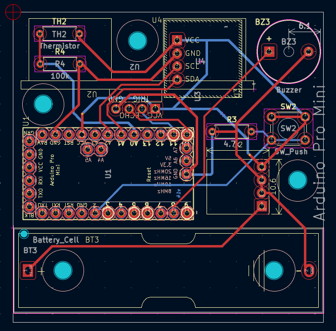
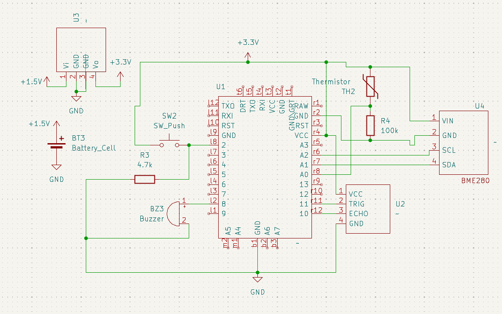
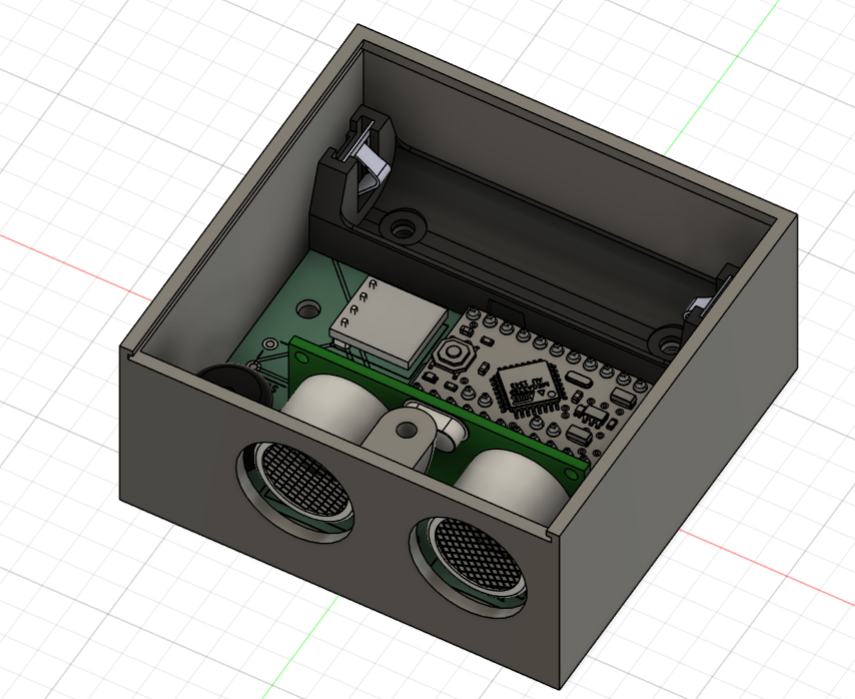
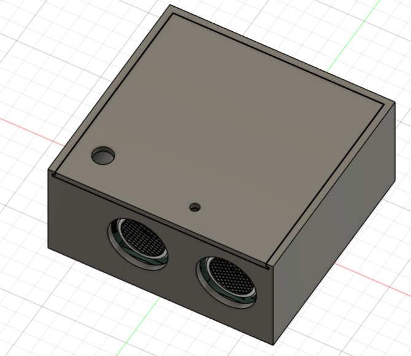

# GarageGuard, guard your garage 24/7/365

### What it is

GarageGuard uses a ultrasonic sensor to detect if the garage door is open for a long period of time and makes an alerts until the door is closed.

### Motivation / Inspiration / Problem

Have you ever had scenarios where you have opened your garage door but it is remained open the next time you checked. 

You realize...oh shoot! The door has been open overnight.

And what's even worse, that there could be animals, like rats, racoons, or even a fox inside your garage.

That's why I designed Garage Guard, your personalized, simple device that alarms you if your garage door is open.

### To use it
To properly use the tool, calibrate the constant to match the distance such that the distance from the product is smaller than the value when door closed and greater otherwise.

After inserting the battery, the device will beep when the door is open for a set period of time.

## Wiring Diagram

## Code example
Go checkout the example code in firmware/GarageGuard and upload it onto the arduino pro mini

For how to upload code onto arduino pro mini using arduino uno, check out https://www.instructables.com/How-to-Program-Arduino-Pro-Mini-Using-Arduino-UNO/

### Image of PCB

### Image of Wiring Schematic

### Image of CAD assembly (without lid)

### Image of CAD assembly (with lid)

## BOM / Parts Breakdown

Checkout docs/BOM.csv for the full BOM.
 